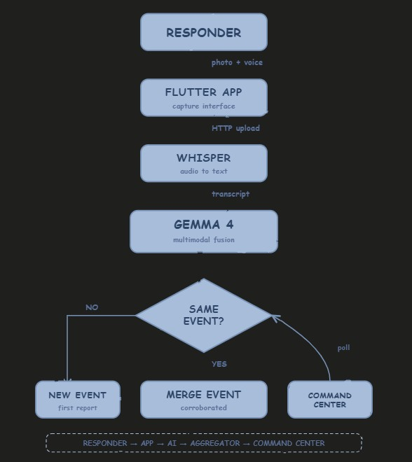

# DisasterWatch

> **Offline-capable AI disaster intelligence for first responders.**
> Powered by Gemma 4 multimodal reasoning.

---

## The Problem

When disaster strikes, first responders face three compounding crises:

1. **Information fragmentation.** Different teams arrive at different angles of the same incident, but there's no shared awareness.
2. **Infrastructure failure.** Cell towers fall during earthquakes. Cloud-based dispatch systems fail precisely when needed most.
3. **Incomplete observations.** Field reports captured in isolation are missing critical context. Real situational awareness requires fusing partial observations from multiple sources.

## The Solution

**DisasterWatch** transforms chaotic field observations into structured emergency intelligence using Gemma 4's multimodal reasoning, then aggregates observations from multiple responders into unified incident records.

### Core Innovation: Cross-Modal Field Intelligence

| Component | What it does |
|---|---|
| **Mobile capture** | Responders snap a photo and add a voice note from their phone |
| **Gemma 4 fusion** | Vision + text reasoning produces structured JSON intelligence (incident type, severity, hazards, response needs) |
| **Spatial-temporal aggregation** | Multiple responder observations within 200m / 30 min are merged into one event |
| **Command center** | Live tactical map shows merged events with corroboration boost |

### Why Gemma 4

This isn't Gemma 4 bolted onto a generic app. The architecture **requires** Gemma 4's specific capabilities:

- **Multimodal reasoning**: fuses image (visual evidence) + transcribed audio (responder context) in a single inference
- **On-device target deployment (E2B)**: designed for Ollama / llama.cpp on field-ruggedized phones where cloud is unavailable
- **JSON-faithful output**: produces validated structured intelligence cards, not free-form text
- **Apache 2.0 license**: deployable by NGOs and emergency agencies without legal friction

### The Wow Moment

When two responders capture the same incident from different angles, Gemma 4's outputs are aggregated by a custom spatial-temporal clustering algorithm. The merged event shows:

- Corroborated by N responders badge
- Boosted confidence from cross-source verification
- Unified hazard map (union of both responders' observations)
- Maximum severity (escalates to worst reported)

This demonstrates what we believe is the most under-explored Gemma 4 capability: **AI as a fusion layer across distributed human observers.**

## Quick Demo (90 seconds)

[Watch the demo video](https://youtu.be/uL8HqfUaJvE)

[Download Android APK](releases/disasterwatch-v1.0.apk)

[Try the Command Center](https://outpour-kilogram-ducking.ngrok-free.dev/command)

---

## Architecture

[Read the full architecture docs](ARCHITECTURE.md)

## Tech Stack

| Layer | Technology |
|---|---|
| **AI Model** | Gemma 4 E2B (multimodal, ~5B params, bf16) |
| **Speech-to-Text** | Whisper base (CPU-friendly) |
| **Mobile App** | Flutter 3.x (Android, iOS-ready) |
| **Backend** | FastAPI + Uvicorn |
| **Tunneling** | ngrok (development) |
| **Mapping** | Leaflet + OpenStreetMap |
| **Storage** | In-memory + SharedPreferences |

## Running It Yourself

### Prerequisites
- Google Colab account (free tier, T4 GPU)
- Hugging Face account with Gemma 4 license accepted
- ngrok free account
- Android device or emulator (for mobile app)
- Flutter SDK 3.3+

### Setup (15 minutes after first download)

**1. Backend (Colab)**
- Open `backend/disasterwatch_colab.ipynb` in Colab
- Set runtime to T4 GPU
- Add Colab secrets: `HF_TOKEN`, `NGROK_AUTH_TOKEN`
- Run all cells top to bottom
- Note the ngrok URL printed

**2. Mobile App**
- Install Flutter SDK 3.3+
- `cd mobile && flutter pub get`
- Open the app, tap settings, paste ngrok URL
- `flutter run` to build to your device

**3. Command Center**
- Open `https://YOUR_NGROK_URL.ngrok-free.dev/command` in any browser
- Click "INJECT DEMO DATA" to see it populated

### Demo Mode (No Backend Needed)
The mobile app includes a cached demo dataset (`assets/demo_cache.json`). When the backend is offline, the app automatically falls back to demo mode showing pre-generated Gemma 4 outputs.

## What Makes This Submission Different

**Most hackathon projects use LLMs as text generators.** We use Gemma 4 as a **structured reasoning engine** that produces validated JSON intelligence cards.

**Most projects are single-modal.** Our core algorithm depends on cross-modal fusion: voice notes adding context that's not visible in photos, and photos providing evidence to weight the voice claim.

**Most projects ignore deployment realities.** Our architecture is designed for the disaster scenario where backends die: the inference layer is interchangeable (Ollama, llama.cpp, cloud) and the mobile app gracefully degrades to cached outputs offline.

## Honest Limitations

This is a **research prototype**. Real deployment would require:

- Mesh networking (current uses centralized server)
- Battery profiling for sustained field use
- Validation by emergency management professionals
- Integration with existing CAD/dispatch systems
- Liability and chain-of-custody frameworks

This prototype demonstrates **technical feasibility** of multimodal AI fusion for distributed field intelligence. Production deployment requires partnership with emergency response agencies. See [LIMITATIONS.md](LIMITATIONS.md) for the full ethics + limitations discussion.

## Hackathon Tracks Targeted

- **Main Track** — Overall vision and technical depth
- **Global Resilience Track** — Disaster response is explicitly named
- **Ollama Special Prize** — On-device Gemma 4 deployment target

## Acknowledgments

- **Google DeepMind** for Gemma 4 and the multimodal-on-edge vision
- **Kaggle** for hosting the hackathon
- **OpenAI Whisper** for free open-source ASR
- **OpenStreetMap contributors** for free tactical mapping
- **Hugging Face** for model distribution infrastructure

## License

Source code: **Apache License 2.0**
Hackathon submission: **CC-BY 4.0** (per competition rules)

You may use this code freely. Attribution appreciated.

---

**Built for the Gemma 4 Good Hackathon // May 2026**